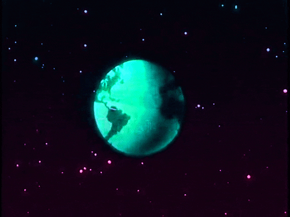

# Aliens-clicker

Le but du jeu est de collecter des aliens en cliquant sur une planète géante jusqu'à ce que vous ayez assez d'aliens pour acheter des améliorations comme des multiplicateur qui multiplie les cliques ou un auto clique qui génère des cliques automatiques, il y a également un bonus qui offre une mise de 200%.

Le gameplay sans fin en fait un jeu qui peut durer une durée indéterminée, ou du moins jusqu'à ce que votre appareil ne puisse plus l'exécuter.

## Langages utilisés

- HTML
- CSS
- Java-script

## Contribuant

[Alice](https://github.com/Frankiethezombie)

[Guillaume](https://github.com/GuillaumeDery98)
